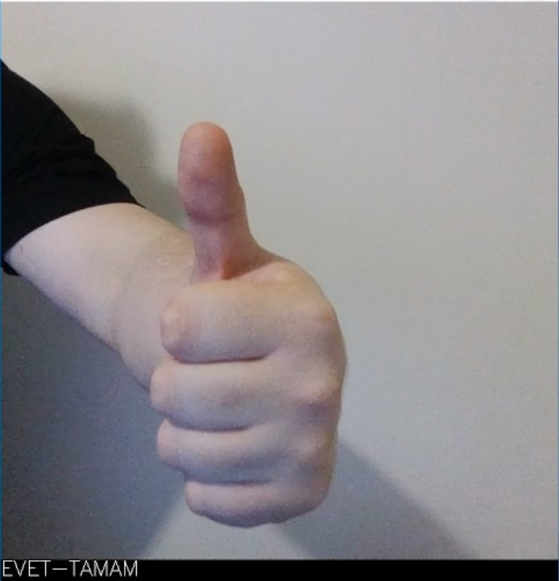
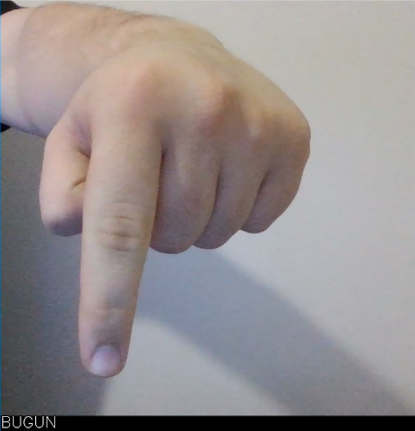

# 🖐️ Sign Language Recognition System

## 📌 Project Overview

Günümüzde işitme ve konuşma engelli bireyler iletişim kurma noktasında önemli zorluklarla karşılaşmaktadır. Bu bireyler, işaret dili bilmeyen kişilerle iletişim kuramadıkları için sosyal, eğitimsel ve mesleki alanlarda çeşitli engeller yaşamaktadır. Teknolojinin sunduğu imkânlar sayesinde bu engellerin büyük kısmı aşılabilir hâle gelmiştir.

Bu proje, yalnızca teknik bir uygulama olmaktan öte, işitme ve konuşma engelli bireylerin sosyal hayata aktif katılımını artırmayı hedefleyen toplumsal bir çözüm sunmaktadır. Kamera üzerinden yapılan işaret dili hareketlerini algılayarak bunları metne dönüştüren sistem, işaret dili bilmeyen kişilerle iletişimi kolaylaştırmayı amaçlamaktadır. Bu çalışma, ilgili soruna çözüm niteliğinde bir başlangıç olarak değerlendirilebilir.

---

## 🖼️ Project Visuals

<p float="left">
  
  
  
  </p>
  
---

## 🚀 Features

✔️ Real-time gesture detection

✔️ Clean OpenCV interface

✔️ A dataset of 12,591 images covering 48 different sign classes

✔️ Custom-created dataset

✔️ TensorFlow/Keras-based model

✔️ Easily implementable in other projects

---

## ⚙️ Installation & Setup

- Clone the repository
```bash
git clone https://github.com/OmerFarukArpa/sign-language-recognition-system
```
```bash
cd your-sign-language-project
```
- Create a virtual environment (optional but recommended)
```bash
python -m venv venv
source venv/bin/activate  # Linux / macOS
venv\Scripts\activate     # Windows
```
- Install dependencies
```bash
pip install -r requirements.txt
```
- Run the application

---

## 📱 How It Works

- Projeyi başlatınız 
- Kamera karşısına geçiniz(hem işaret dili ifadesini yapacak kişi hem de algılayacak kişi)
- İşaret dili ifadesini kameraya yapınız
- İşaret dili ifadesinin anlamı metinsel olarak ekrana yazdırılır, ikinci kişi olur ve iletişim sağlanır

---

## 🛠️ Technologies Used

- Python: Projenin tamamı Python programlama dili ile geliştirilmiştir. Açık kaynak olması, geniş kütüphane desteği ve yapay zeka alanında yaygın olarak kullanılmasından dolayı tercih edilmiştir.

- OpenCV: Gerçek zamanlı görüntü işleme görevleri için kullanılmıştır. Kamera görüntülerinin işlenmesi, çerçeve oluşturma, el hareketlerinin algılanması ve modele uygun giriş hazırlanması işlemleri OpenCV ile gerçekleştirilmiştir.

- TensorFlow & Keras: Modelin çalıştırılmasında TensorFlow altyapısı ve Keras arabirimi kullanılmıştır. Projede kullanılan model .h5 formatındadır ve Keras ile tam uyumludur.

- NumPy: Verilerin matematiksel olarak işlenmesi, çok boyutlu diziler ile çalışma ve model girişlerinin hazırlanması gibi işlemler için NumPy kullanılmıştır.

---

## 🖼️ Dataset Creation

Bu projede hazır bir veri seti kullanılmamış, tüm görseller tarafımca üretilmiştir. Bu yaklaşım, projenin özgünlüğünü artırmak ve modelin gerçek hayata daha iyi uyum sağlamasını sağlamak amacıyla tercih edilmiştir.

Veri oluşturma sürecinde Türk İşaret Dili Sözlüğü temel kaynak olarak alınmıştır. Harfler ve en çok kullanılan ifadeler için kamera karşısında farklı açılar ve ışık koşullarında çok sayıda görüntü çekilmiştir. Böylece modelin farklı kullanıcılar ve çevresel koşullara dayanıklı olması hedeflenmiştir.

Toplamda 48 sınıf oluşturulmuştur:

- 22 işaret dili harfi

- 24 sık kullanılan ifade

- Toplam üretilen veri:12.591 adet görüntü (tamamen manuel olarak oluşturulmuş)

---

## ⚖️ Data Balance

Her sınıfa ait görsel sayısının dengeli tutulmasına özen gösterilmiştir. Bu, modelin belirli sınıflara karşı taraflı (bias) davranmasını engellemiş ve tahmin doğruluğunu artırmıştır.

Sınıflar arası dengesizlik olmadığında modelin daha kararlı, stabil ve yüksek doğruluk oranlarıyla çalıştığı gözlemlenmiştir.

---


